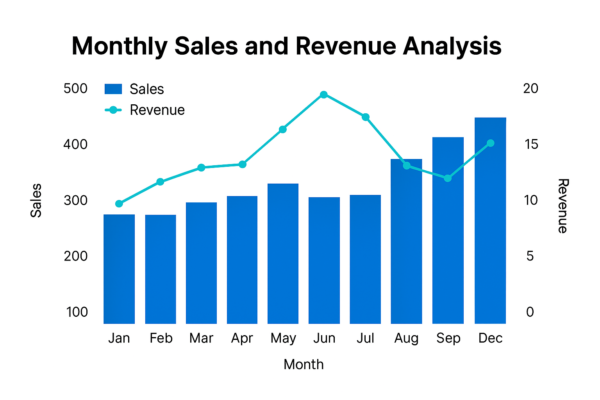

# 📊 Sales Data Analysis

## 📌 Project Overview

This project explores a sales dataset to identify key patterns, trends, and insights. It includes data cleaning, exploratory analysis, and visualizations to support business decisions related to product performance and customer behavior.

## 🧰 Tools & Technologies

- Python (Pandas, NumPy)
- Jupyter Notebook
- Matplotlib, Seaborn
- Data Cleaning, Aggregation, Visualization

## 📁 Project Structure

/sales-data-analysis/
├── sales_analysis.ipynb # Main Jupyter Notebook
├── /images/ # Visualizations from analysis
└── README.md # Project documentation

## 🔍 Key Insights

- Identified top-selling product categories and trends over time
- Highlighted seasonal peaks and customer preferences
- Cleaned and prepared raw sales data for visualization

## 🧠 Next Steps

- Automate weekly sales reporting
- Integrate predictive sales models
- Create a dashboard in Power BI or Tableau

---

*This project was developed as part of the TripleTen Data Analytics Bootcamp.*

## 📈 Visualization Example

